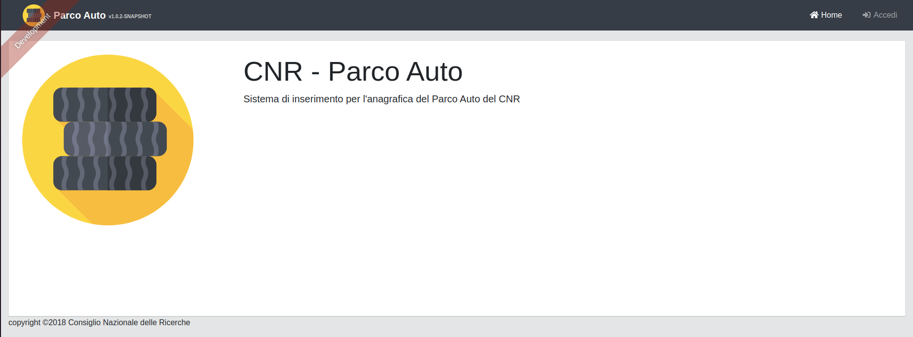
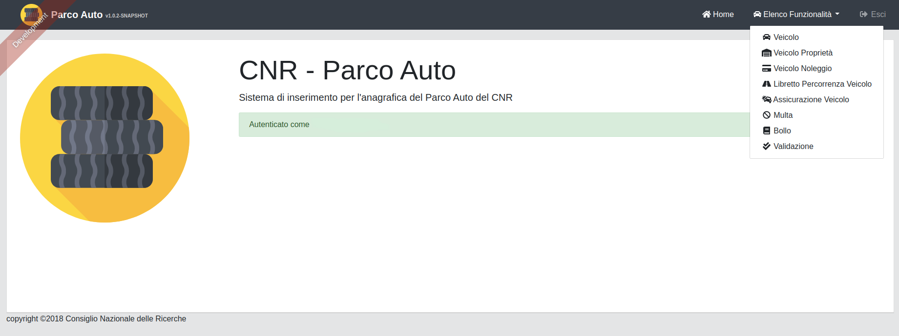

ACCESSO APPLICATIVO
===================

All’indirizzo https://parcoauto.cnr.it è disponibile la procedura di
Parco Auto del CNR. Per poter entrare nella procedura occorre cliccare
sul pulsante Accedi visibile in fig. 1. Inserire l’utenza e la password
di siper.

   	Schermata principale

Da qui è possibile cliccare nella barra in alto la voce Elenco
Funzionalità dove troverete le seguenti sezioni:

-  Veicolo
-  Veicolo Proprietà
-  Veicolo Noleggio
-  Libretto Percorrenza Veicolo
-  Assicurazione Veicolo
-  Multa
-  Bollo.

Come è possibile vedere in fig. 1-1.

   	Schermata principale dopo l'accesso

.. warning::

    Occorre inserire il Veicolo per poter inserire tutte le altre Sezioni.
