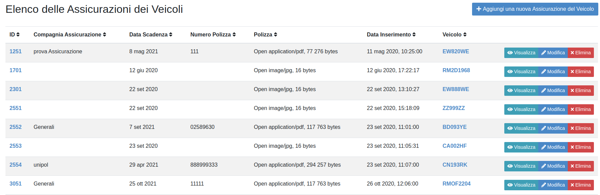

ASSICURAZIONE VEICOLO
=====================

Al momento del salvataggio di un veicolo di proprietà il sistema in automatico inserisce il veicolo nella sezione “Assicurazione veicolo” in attesa che vengano compilati i dati assicurativi.
Per inserire i dati assicurativi riferiti ad un veicolo dal menù “Elenco Funzionalità” cliccare sulla sezione “Assicurazione veicolo”.

INSERIMENTO DATI ASSICURAZIONE VEICOLO (primo periodo assicurativo)
-------------------------------------------------------------------
Selezionare il veicolo dall’elenco dei veicoli della struttura e cliccare sul tasto modifica (fig. 12)

   	Elenco delle Assicurazioni dei Veicoli

aggiungere i dati relativi alla assicurazione indicando i riferimenti della polizza (numero e validità) ed allegarla (fig.13).

   	Nuova Assicurazione del Veicolo

INSERIMENTO DATI ASSICURAZIONE VEICOLO (periodi successivi al primo)
--------------------------------------------------------------------

Per inserirne i dati assicurativi dei periodi successivi al primo si dovrà cliccare sul tasto “Aggiungi una nuova Assicurazione del Veicolo”
Successivamente si dovrà selezionare dal menu a tendina “Veicolo” il veicolo a cui è riferita l’assicurazione ed inserire tutti i campi all’interno dell’assicurazione Veicolo.

Dopo il salvataggio l’inserimento comparirà nell’elenco dei dati assicurativi per ogni veicolo della Struttura e potrà essere visualizzato, modificato o eliminato.

