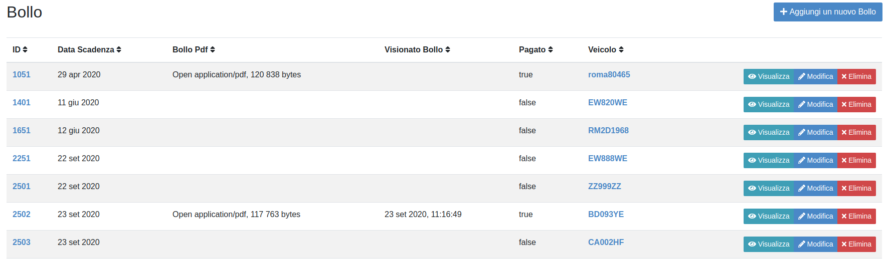
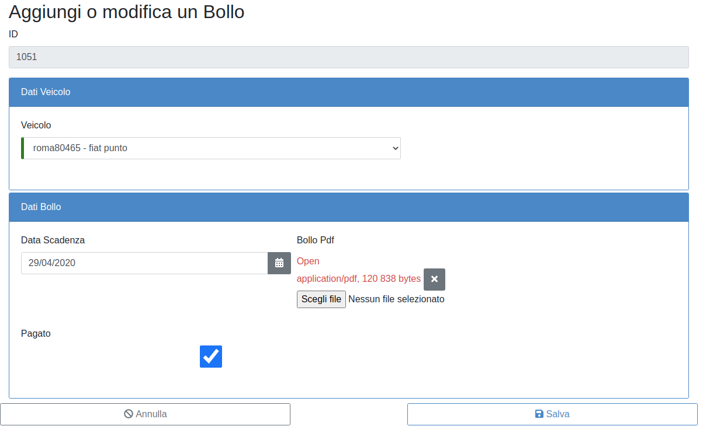

BOLLO
=====

Al momento del salvataggio di un veicolo di proprietà il sistema in automatico inserisce il veicolo nella sezione “Bollo” in attesa che vengano compilati i dati relativi.
Per inserire i dati del bollo riferiti ad un veicolo dal menù “Elenco Funzionalità” cliccare sulla sezione “Bollo”.

INSERIMENTO DATI BOLLO AUTO (primo periodo)
-------------------------------------------

Selezionare il veicolo dall’elenco dei veicoli della struttura e cliccare sul tasto modifica (fig. 14)

   	Elenco Bollo

Completare i dati mancanti (fig.15)

   	Modifica di un Bollo

Dopo il salvataggio il bollo comparirà nella lista dei bolli per ogni veicolo della Struttura e potrà essere visualizzato, modificato o eliminato.

INSERIMENTO DATI BOLLO AUTO (periodi successivi al primo)
---------------------------------------------------------
Per inserire i dati del bollo per gli anni successivi al primo occorre premere il pulsante “Aggiungi un nuovo Bollo” all’interno della funzionalità “Bollo” (fig.15) e selezionare dal menù a tendina “Veicolo” il veicolo a cui è riferito il bollo, inserendo poi tutti i campi richiesti.

Dopo il salvataggio il bollo comparirà nella lista dei bolli per ogni veicolo della Struttura e potrà essere visualizzato, modificato o eliminato (fig.16).

