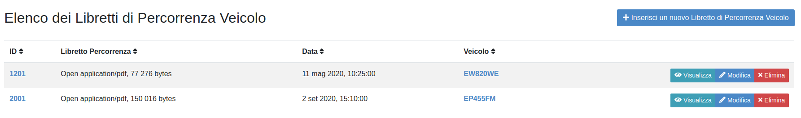
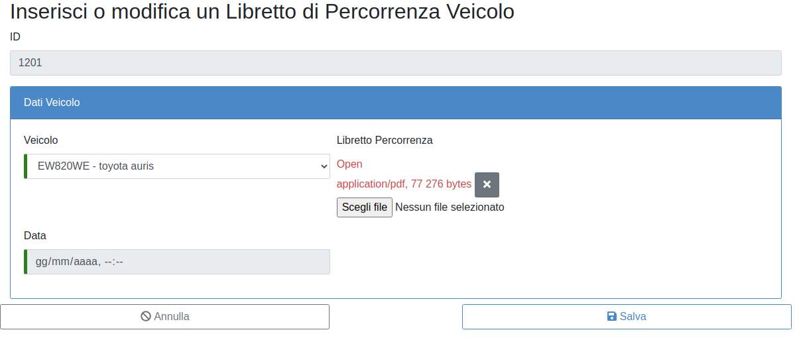

LIBRETTO PERCORRENZA VEICOLO
============================

Per inserire il libretto di percorrenza del veicolo dal menù “Elenco Funzionalità” cliccare sulla sezione “Libretto percorrenza veicolo”.
In questa sezione cliccando sul tasto “Inserisci un nuovo libretto di percorrenza veicolo” (fig. 9) si potranno inserire i dati di percorrenza con la data e il veicolo a cui si riferisce la percorrenza oltre che effettuare il caricamento del libretto.

   	Elenco Libretti percorrenza veicolo

Sarà data la possibilità di inserire le percorrenze esclusivamente per i veicoli della propria Struttura figura 10.

   	Inserisci Libretto percorrenza veicolo

Nella sezione vi è la possibilità di visualizzare tutti i libretti di percorrenza del veicolo associati all’istituto visualizzarli, modificarli o eliminarli (fig. 11).

