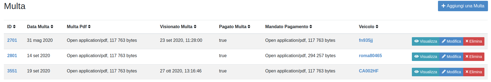
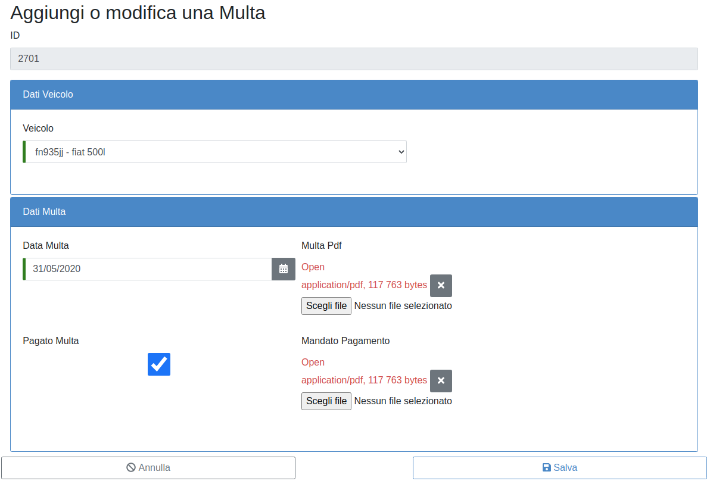

MULTA
=====

La sezione “Multa” è stata inserita per consentire alle Strutture di monitorare le sanzioni del codice della strada che sono state notificate. Questo consentirà di gestire i pagamenti e potrà consentire all’Amministrazione, se del caso, di contestare tempestivamente le eventuali cartelle di pagamento erroneamente emesse evitando ripercussioni negative sull’estratto conto fiscale dell’Ente.

   	Elenco Multe

Per inserire una nuova multa (fig. 17) occorre cliccare su “Aggiungi multa” all’interno della sezione “Multa”
ed inserire tutti i campi all’interno della multa (fig.18) selezionando il veicolo al quale si riferisce.

   	Nuova Multa

Dopo il salvataggio la multa comparirà nella lista delle multe per ogni veicolo della Struttura e potrà essere visualizzata, modificata o eliminata (fig.19).

