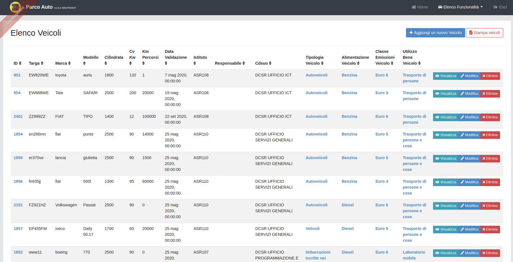
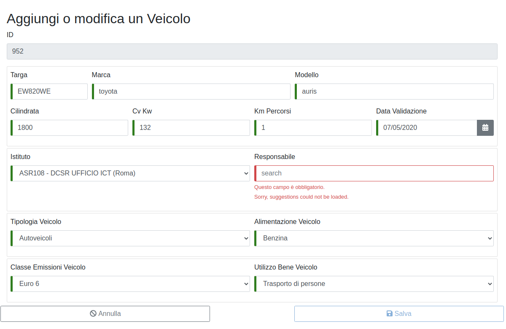

VEICOLO
=======
Premendo su “Veicolo” dal menù “Elenco funzionalità” si accede alla schermata “Elenco Veicoli”  (fig.2)
dalla quale si potrà visionare l’elenco di tutti i veicoli della Struttura se inseriti.

   	Elenco Veicoli

remendo su “Aggiungi un nuovo veicolo” si potrà inserire un nuovo veicolo.
Le textbox segnate in rosso sono obbligatorie.
Per il responsabile occorre inserire il nome o il cognome ma comunque verrà salvato nel formato “nome.cognome” della
persona interessata e comparirà in automatico la lista delle persone con quel nome da selezionare (fig. 3).
Nella figura 3 si riporta un esempio di inserimento.

   	Inserimento nuovo Veicolo

Dopo aver inserito e salvato i dati richiesti il veicolo verrà inserito nell’elenco dei veicoli riferibili alla Struttura (fig.4).
Occorrerà poi specificare se il veicolo è in carico alla Struttura a titolo di proprietà  o in forza di un contratto di noleggio,
l’inserimento come veicolo di proprietà inibisce la possibilità di inserire il medesimo veicolo come detenuto
in forza di contratto di noleggio.
