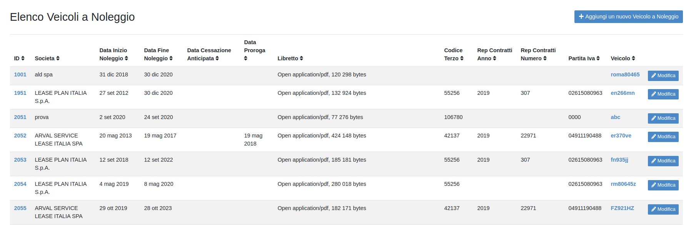
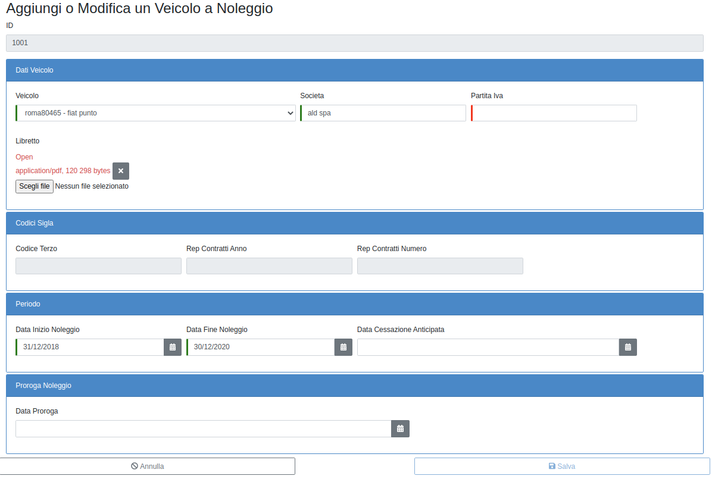

VEICOLO NOLEGGIO
================

   	Elenco Veicoli a Noleggio

PRIMA CODIFICA DI UN VEICOLO A NOLEGGIO
---------------------------------------

Per la codifica dei un veicolo a noleggio dal menù “Elenco funzionalità” occorre cliccare sull’apposito campo “Veicolo Noleggio”
e cliccare su “Aggiungi un nuovo Veicolo a Noleggio” (fig. 7).

   	Nuovo Veicolo a Noleggio

Inserire tutti i dati obbligatori e al momento del salvataggio il sistema confrontando
la partita iva ed il periodo di noleggio sarà in grado di riportare automaticamente i dati relativi al codice terzo e
repertorio contratti inseriti in SIGLA relativamente a quel contratto.

CESSAZIONE ANTICIPATA O PROROGA CONTRATTI DI NOLEGGIO
-----------------------------------------------------

Dalla sezione “Veicolo a noleggio” del menù “Elenco funzionalità” sarà sufficiente selezionare dall’elenco dei
veicoli a noleggio il veicolo di interesse e cliccare sul tasto “Modifica”.

Si aprirà il form di modifica del veicolo del quale si dovranno compilare la sottosezione “Periodo” indicato
la data di cessazione anticipata oppure la sottosezione “Proroga noleggio” indicando i dati relativi. (fig. 8).

