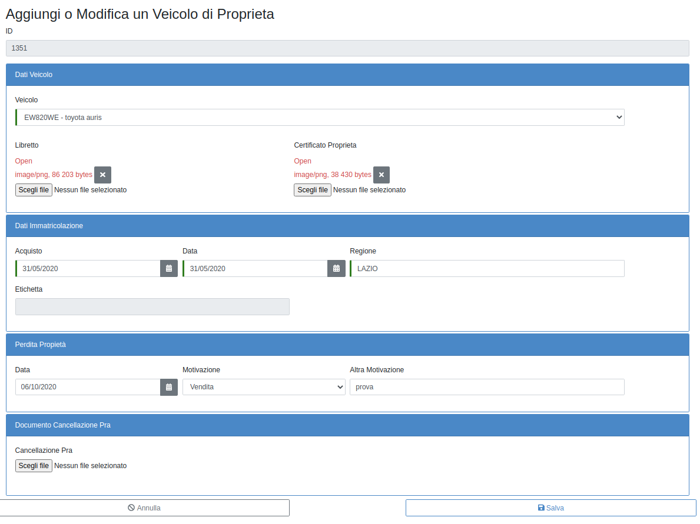

VEICOLO PROPRIETÀ
=================

PRIMA CODIFICA DI UN VEICOLO DI PROPRIETÀ
------------------------------------------

Per la codifica di un veicolo di proprietà dal menu “Elenco funzionalità” occorre cliccare sull’apposito campo “Veicoli di Proprietà”
e cliccare su “Aggiungi un nuovo veicolo di proprietà” (fig. 5).

   	Elenco Veicoli di Propietà

Sarà quindi necessario compilare le sottosezioni “Dati veicolo” e “Dati immatricolazione” trascurando le altre.
Nella sezione “Dati veicolo”, in fase di primo inserimento sarà innanzitutto richiesto di scegliere il veicolo da caricare in proprietà mediante scelta dall’apposito menù a tendina tra i veicoli già caricati per la Struttura.
Nel form occorrerà inserire tutti i dati obbligatori e in particolare i dati relativi all’immatricolazione.
In fase di salvataggio se la targa è stata correttamente inserita nella procedura SIGLA il sistema sarà in grado di riportare automaticamente
l’etichetta del veicolo con il quale lo stesso è stato inventariato sul programma di contabilità.
Dopo aver salvato si troverà il veicolo inserito nella lista dei veicoli di proprietà della Struttura.

   	Nuovo Veicolo di Propietà

Immediatamente dopo il salvataggio verrà inoltre inviata dal programma una mail che ricorderà di inserire il bollo e l’assicurazione del veicolo inserito. (Si vedano pagg. 10 e 11).

PERDITA DELLA PROPRIETA’ DI UN VEICOLO GIA’ CARICATO
----------------------------------------------------

Dalla sezione “Veicolo di proprietà” del menù “Elenco funzionalità” sarà sufficiente selezionare dall’elenco dei veicoli in proprietà il veicolo di interesse e cliccare sul tasto “Modifica”.

Sarà quindi necessario compilare la sottosezione “Perdita proprietà” ed, eventualmente, la sottosezione “Documento cancellazione PRA” se la perdita di proprietà è motivata dalla cancellazione del veicolo dal Pubblico Registro Automobilistico.
